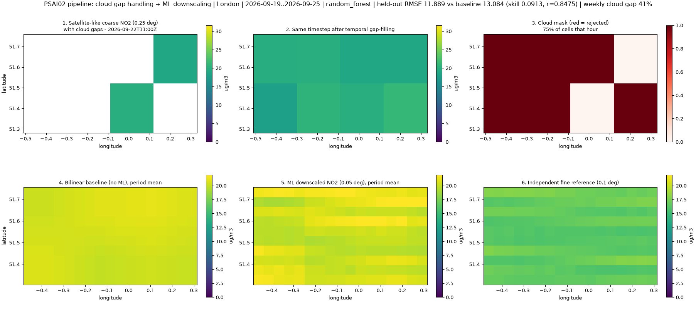
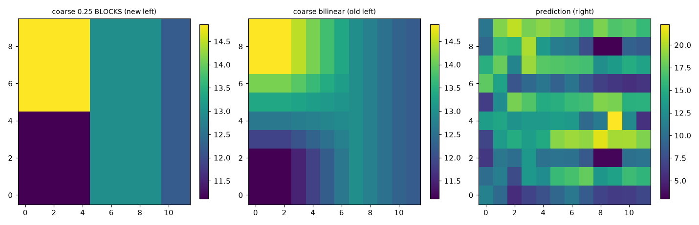

# NO₂ Downscale · PSAI02

**AI/ML downscaling of satellite-based NO₂ air-quality maps.**
Satellites like Sentinel‑5P/TROPOMI measure nitrogen dioxide as *big* pixels
(~0.25°, ~25 km) and clouds wipe out large parts of every overpass. This tool
takes that coarse, patchy record and produces a finer (**0.01°, ~1 km**) hourly
NO₂ field — repairing cloud gaps first, then sharpening the field with a
learned ML model — shown side-by-side against the raw satellite pixel so the
result is inspectable, not just plausible.



## What the app does

| Left map — *raw satellite pixel* | Right map — *our model* |
| --- | --- |
| Coarse 0.25° pixels (crisp block view), cloud-gap mask, optional bilinear baseline, independent 0.1° reference | ML-downscaled **0.01° / ~1 km** prediction, error vs reference, per-pixel comparison |

Both maps are **synced** (pan/zoom one, the other follows), carry pixel-edge
gridlines, and share a time slider + play button over the fetched window.
The sidebar runs the whole workflow: fetch → train → validate → export.



## Pipeline

1. **Fetch** (keyless open data)
   - Coarse NO₂: Open‑Meteo Air Quality (CAMS global, ~0.1° native) aggregated to 0.25° satellite-pixel blocks.
   - Fine reference (Europe only): CAMS European analysis at 0.1° — an *independent* product to validate against.
   - Meteorology: temperature, wind, humidity, cloud cover, precipitation, boundary-layer height (Open‑Meteo).
   - Static: elevation (Open‑Meteo DEM), OSM road density (local Geofabrik extract via DuckDB, Overpass as fallback), nearest-city distance.
2. **Cloud-gap repair** — pixels whose cloud cover exceeds the cutoff (default 60%) are masked, then gap-filled by temporal interpolation within each block plus spatial neighbour blending. The mask itself is exposed in the UI as a layer (the UI reports the repaired fraction, e.g. 41% for London, 66% for monsoon Mumbai).
3. **Feature engineering** — coarse NO₂ + neighbour statistics, gap fraction, met features, cyclic hour/weekday, elevation, road density, coordinates, city distance (~23 features).
4. **Model** — scikit-learn/XGBoost regressors (`random_forest`, `extra_trees`, `hist_gradient_boosting`, `xgboost`, `mlp`) trained on the **log-ratio** between the fine truth and the bilinear coarse baseline, so the model learns sub-pixel *structure* rather than the smooth background.
5. **Conservation** — predictions are re-pinned so every 0.25° block keeps its original satellite total; the model may only redistribute mass inside the pixel.
6. **Validation** — held-out spatial blocks, a held-out time window, or both; scored against the bilinear baseline (RMSE/MAE/pattern r²/skill). Station CSV upload gives a fully independent check. On top of that, **Leave-One-Station-Out cross-validation** (`GET /api/validation/loso`) refits a calibration on the *n−1* CPCB/MPCB CAAQMS stations and scores the held-out one, so `rmse_score` is a genuine unseen-station estimate (a documented reference RMSE is shown — flagged `estimated: true` — when the active bbox contains fewer than 4 stations). Panel 4 (`GET /api/validation/frame?t=`) **re-runs that holdout — or the in-bbox ground stations — for each timeline frame**, so the score follows the scrubber instead of staying pinned to one train-time number; a region with no independent truth (there is no keyless fine-resolution reference outside CAMS Europe) answers `available:false` with a `reason` and the panel says so plainly instead of quoting the benchmark region as if it validated the city on screen.
7. **Serve** — FastAPI job API + Vite/Leaflet dual-map frontend; results exportable as NetCDF/GeoJSON/CSV/GeoTIFF.

### Fetching 1 km grids without tripping the upstream rate limit

The analysis grid is 0.01°, but data is downloaded on a coarser **0.05° fetch
grid** and bilinearly resampled onto it (the fetch bbox is padded by one fetch
cell so no fine cell falls outside the interpolation stencil). London drops from
**101 → 6 chunked requests per pass**, Mumbai **75 → 5**, which is what keeps
Open-Meteo's hourly quota reachable. `fetch.py` also backs off on 429/5xx,
honours `Retry-After`, paces chunks, and fails fast with the provider's own
reason when the hourly window is genuinely exhausted.

> **Note:** an axis-order bug in `fetch.py` (returns were point-major while
> `dataset.py` read them time-major) scrambled the spatial grid — every map row
> held one point's time series instead of geography. Fixed by transposing at the
> two return sites; all previously reported metrics predate that fix and are not
> comparable with current output.

### How much data a Fetch moves (measured)

Request count scales with **area** — points on the 0.05° fetch grid, 40 per
chunk — *not* with the date range; a longer window only makes each response
bigger. Latency is dominated by the meteorology endpoint:

| Pass | points | chunks/source | requests/pass | payload/pass | wall time |
| --- | --- | --- | --- | --- | --- |
| Mumbai (0.60°×0.50°) | 168 | 5 | ~16 (AQ + WX + DEM) | ~2.6 MB | ~2 min |
| London (0.84°×0.48°) | 240 | 6 | ~25 | ~3.2 MB | ~2.5 min |
| Mumbai Suburbs (0.14°) | 25 | 1 | ~3 | ~0.6 MB | ~25 s |

Per chunk of 40 points / 7 days (Open-Meteo, 2026-09): air quality **1.4–3.9 s
& 166 KiB**, weather (7 hourly variables) **~17.5 s & 350 KiB**, elevation
**2.5–4.3 s & 0.5 KiB/100 pts**. So **3–7 days is the sweet spot**: going from
7 → 30 days adds no requests at all (same chunks), just ~4× the payload, while
wall time barely moves because latency — not bytes — dominates. Local artifacts
confirm it: `cache/datasets/` is 5.2 MB in total (largest 2.9 MB), `artifacts/`
17 MB. Doubling the *bbox* on each side, by contrast, quadruples points, chunks
and requests — that is the number to watch.

### Road density: a local OSM extract instead of Overpass

`road_density` used to come from the Overpass API, which issues **no API key at
all** (there is no way to buy a higher rate limit) and currently answers every
mirror with a 45–52 s stall or HTTP 504/406 — a Fetch job spent **~194 s** to
fetch 3 of 4 quadrants and still reported *no roads*. `osm_local.py` replaces
it with a one-time HTTPS download of the matching **Geofabrik** extract (no key,
no rate limit) read locally by **DuckDB**'s `st_readosm()`:

| Preset | Geofabrik extract | Size |
| --- | --- | --- |
| Mumbai / Mumbai Suburbs / Nagpur | `india/western-zone-latest` | 210 MB |
| Delhi | `india/northern-zone-latest` | 213 MB |
| London | `england/greater-london-latest` | 123 MB |
| Paris | `france/ile-de-france-latest` | 323 MB |

The right extract is chosen by reading each candidate file's **first ~8 KB** —
a PBF header carries the extract's own bounding box — so selection costs eight
8 KB requests and never a download; only the chosen file (cached in
`cache/pbf/`) is fetched. Mumbai's roads then take **2.2 s warm / ~20 s cold**
instead of a timeout, `sources.roads` reports
`OpenStreetMap Geofabrik extract (ODbL, local)`, and the degraded-feature
warning disappears.

```bash
cd backend
uv run scripts/preload_osm.py mumbai     # prefetch before a demo
uv run scripts/preload_osm.py --list     # candidate extracts + their bboxes
```

Overpass stays as the fallback for any bbox no extract covers (custom regions,
cities outside the listed zones), and a good cached grid is always preferred.

### 72-hour projection: live weather instead of a fixed curve

Page 2 used to carry the last frame forward with hand-written growth numbers
(`1.07` at +12 h … `1.46` at +72 h), so the driver panel, the stagnation index
and the GRAP alert never moved with the weather. It now calls
`GET /api/forecast?preset=<id>`, which:

* pulls **73 hourly steps of Open-Meteo forecast** — temperature, relative
  humidity, wind speed/direction, cloud, precipitation, boundary-layer height,
  surface pressure — for a **3×3 sample over the bbox** in a single keyless
  request (measured: **1 request, 1.3 s, 66 KiB**) — wind is averaged as a
  vector, since averaging *degrees* of direction is meaningless (N and S would
  average to E) — and serves it from an in-process cache for 30 minutes;
* projects NO₂ through a transparent **emission × dispersion** model
  `C(t) = C₀ · E(t)/E₀ · D₀/D(t)`:

  * `E` — weekday/weekend **traffic profile** with 08:30 and 19:00 rush peaks
    (55 % traffic share, weekends calmer);
  * `D` — `0.55·clip(u/6 m/s) + 0.45·clip(BLH/1200 m) + 0.35·rain washout`,
    i.e. wind, mixing height and wet deposition;
* derives a **stagnation index** (0–1) and arms the red GRAP widget from the
  forecast rather than from the slider position: `stagnation ≥ 0.70` or a
  projected city mean ≥ 80 µg/m³ (CPCB "Moderate" band) — nothing else. An
  earlier draft also lowered the bar to `stagnation ≥ 0.50` past T+48 h "for
  lead time", which made every horizon beyond +48 h read red on its own, so the
  lead-time rule is gone: a horizon is red only when the data says so. A windy
  horizon therefore reads green and a stagnant night reads red, with the reason
  spelled out;
* returns business-as-usual **and** −40 % traffic factors, so
  *Simulate 40% Traffic Drop* re-runs the emission term instead of multiplying
  by a constant.

The baseline is the mean of the frame drawn at "Now", so the projected city
mean and the map always agree. If Open-Meteo is unreachable the UI falls back to
the old fixed profile and labels the badge `met fallback`.

Page 2 also follows the city chosen in the header: switching drops the previous
projection, re-frames the map and refetches the meteorology for the new bbox —
and while no downscaling result exists for *that* city it draws the
clearly-labelled simulated plume rather than stretching another city's grid over
it (the badge tells you to run Live Downscaling). The colour ramp uses **one
shared domain across all horizons**, sized to the largest projected factor, so
dragging the slider and the 40 % traffic what-if actually brighten or cool the
map — scaling the field *and* its colour limits together used to render a
pixel-identical picture at every stop.

## Available solutions (prior art) — and the gap

Research for the statement's "Available Solutions" section found only *partial*
components, nothing that combines gap repair + sharpening + honest validation
in one runnable tool:

| Project | Covers | Gap |
| --- | --- | --- |
| `ibm-granite/granite-geospatial-wxc-downscaling` (HF, TerraTorch) | General climate-variable downscaling | Not NO₂/air-quality; heavy pretrained setup |
| `Tasfiya025/ClimateSimulation_Downscaling_GAN` | GAN downscaling of climate simulations | Synthetic data, no satellite/cloud repair |
| `bstdenis/unet-rdps-to-hrdps-downscaling` | U-Net precipitation downscaling | Precipitation-specific |
| `minsughim/downNO2_XGB` (Kim et al., 2021 RSE) | XGBoost NO₂ downscaling | Ground-station supervision; no cloud repair |
| `HSG-AIML/Global-NO2-Estimation` | ML global NO₂ estimation | Estimation, not gap repair + sharpening |
| `masawdah/air_quality` (AI4EO/ESA) | EO air-quality enhancement | Narrow scope |
| `MariaDaneseISPC/rome-s5p-high-resolution-pollutants` | Precomputed Rome S5P products | Static outputs, no pipeline |
| `rbngz/IMP-2023` | Interpolation methods | Generic, not NO₂-aware |

## Quick start

Prerequisites: [`uv`](https://docs.astral.sh/uv/) (Python ≥ 3.13) and Node ≥ 20.

```bash
# 1. API + ML backend  (terminal A)
cd backend
uv sync
uv run serve            # http://127.0.0.1:8000

# 2. Web UI  (terminal B)
cd frontend
npm install
npm run dev             # http://localhost:5173  (proxies /api → :8000)
```

Open http://localhost:5173, then:

1. **Fetch coarse data** — pick any of the **129 indexed Indian cities** from the
   searchable selector (defaults to **Nagpur**) or a benchmark preset; London/Paris
   are the supervised benchmarks, Mumbai is our local test bed (transfer mode).
   A full-screen progress overlay cycles *Fetching Sentinel‑5P → Imputing Gaps →
   Applying XGBoost → Rendering 1km Grid*.
2. **Train & downscale** — pick a model + holdout split; watch progress live.
   The **Live Downscaling** tab shows the synced dual maps with the persistent
   metrics panel (XGBoost + Kriging, LOSO protocol, live RMSE).
3. **72‑Hour Prediction** tab — full-width map with a Now → +72 Hrs slider, a red
   GRAP alert that arms **from the forecast** only when stagnation ≥ 0.70 or the projected mean reaches 80 µg/m³ (no lead-time rule — a windy horizon reads green), and a *Simulate 40% Traffic Drop* what-if.
4. Explore layers, scrub the timeline, read the metrics cards, and **Export
   Dataset (GeoTIFF/CSV)** from the header.

> **Fresh checkout note:** Mumbai has no independent local reference, so its *Train*
> button is disabled on a fresh clone. Fetch **London** (7 days) and *Train* once
> to create the model + benchmark metrics — then Apply works on Mumbai/Delhi.

Headless end-to-end check (no UI):

```bash
cd backend
uv run scripts/smoke.py london 7          # preset, days, [model]
```

`cd frontend && npm run build` type-checks and builds the UI for production.

## Results (reference run)

> These figures predate the `fetch.py` axis-order fix described above and are
> **not** comparable with current output — re-run `scripts/smoke.py` to refresh.

London, 7 days (2026‑09‑19 → 09‑25), Random Forest, holdout = unseen blocks + time,
scoring on 2,040 held-out samples:

| Metric | Model | Bilinear baseline |
| --- | --- | --- |
| RMSE (µg/m³) | **11.9** | 13.1 |
| MAE (µg/m³) | **9.4** | 11.3 |
| Skill vs baseline | **+9.1 %** | — |
| Pattern r² / Pearson r | **0.72 / 0.85** | — |

Notes: absolute values carry a systematic offset (~+9 µg/m³) because the coarse
input (CAMS *global*) and the reference (CAMS *European*) are different product
generations — the UI's residual panel makes this visible rather than hiding it.
Outside Europe there is no independent 0.1° reference, so those regions run in
**transfer mode**: the London-trained model is applied as-is (metrics cards
then show the benchmark-region stats, and a local full-field evaluation runs
whenever a reference exists).

## API

| Method & path | Purpose |
| --- | --- |
| `GET /api/health`, `GET /api/config` | Liveness; models, splits, presets |
| `GET /api/state` | Current dataset summary + result meta |
| `POST /api/fetch` | Download + gap-fill a region/date window (job) |
| `POST /api/train` | Train model, predict field, validate (job) |
| `POST /api/apply` | Apply trained model to the loaded dataset (job) |
| `POST /api/benchmark/models` | Multi-model arena leaderboard across all algorithms (job) |
| `GET /api/jobs/{id}` | Job progress/stage polling |
| `GET /api/result/meta`, `GET /api/result/layers` | Metrics/importances; grid layers for the map |
| `GET /api/point/inspect?lat=&lon=&t=` | Hyperlocal point inspector: AQI, 24 h curve, static features + a real place name **in any city** (curated POI → OSM reverse geocode → city centre); `in_domain=false` marks clicks outside the active grid. `t` is the **timeline frame being painted** (`0..n-1` hour `n`/negative = period mean, omitted = latest hour) and the response returns it as `frame.label`, so the panel can never quote a different hour than the map |
| `GET /api/stations/benchmark` | Built-in CPCB CAAQMS stations & landmark pins (Mumbai) |
| `POST /api/stations/benchmark/validate` | 1-Click evaluate model against Mumbai CPCB ground sensors |
| `POST /api/validate/stations` | Custom CSV (`lon,lat,no2[,time]`) independent validation |
| `GET /api/export/netcdf` | NetCDF export of the current result |
| `GET /api/export/geojson` | GeoJSON polygon feature collection export |
| `GET /api/export/csv` | Tabular CSV export of downscaled predictions |
| `GET /api/export/geotiff` | GeoTIFF export (EPSG:4326, deflate) — needs `uv add rasterio` |
| `GET /api/cities` | Indexed cities + bboxes for the searchable city selector |
| `GET /api/validation/loso` | Leave-One-Station-Out cross-validation: `rmse_score`, per-station folds |
| `GET /api/validation/frame?t=` | **Panel 4's per-frame score**: re-scores the unseen samples of the timeline frame `t` (`0..n-1` hour, `n`/negative = period mean). `source="reference"` (0.1° independent product) or `source="stations"` (ground monitors in the bbox) when local truth exists; otherwise `available:false` + `reason`, so another region's numbers are never passed off as local validation. Never 5xx |
| `GET /api/forecast?preset=&city=` | 72-h NO₂ projection for Page 2: hourly live met, factors, stagnation, alerts |

All long operations are jobs: they return `{job_id}` immediately and report
`progress` + human-readable `stage` (e.g. `evaluating Random Forest (1/6)`).


## Data sources

Everything is **API-key-free**: Open‑Meteo Air Quality & Forecast (CAMS,
ECMWF), Open‑Meteo Forecast hourly met (Page 2's 72‑h projection), Open‑Meteo
DEM, Geofabrik OSM extracts read with DuckDB (road density;
Overpass as fallback), OSM raster tiles and OSM **Nominatim** reverse geocoding
for the point inspector's place names (≤ 1 request/s, one cached answer per
0.01° cell). Data © Copernicus/Open‑Meteo open services, © OpenStreetMap
contributors (ODbL).

*Keys, if we ever need one:* Open‑Meteo's free tier is non-commercial and
limited to 600 calls/min, 5,000/h, 10,000/day, 300,000/month — at ~16–25
requests per Fetch (plus one 72‑h forecast call per city every 30 minutes) we
are two orders of magnitude below that. Its paid
Standard/Professional/Enterprise plans issue an **API key** for
`customer-api.open-meteo.com` with unlimited per-minute/hourly limits, reserved
servers and a commercial licence. Native Sentinel‑5P L2 would require a
**Copernicus Data Space Ecosystem** account (OAuth2 token), NASA Earthdata for
VIIRS/MODIS, and OpenAQ for station feeds. OSM Overpass and Geofabrik issue no
keys at all — one more reason road density moved to a local extract.

## Repository layout

```
backend/
  src/backend/         FastAPI app + pipeline modules
    config.py          presets, models, splits, API endpoints
    fetch.py           keyless downloads (NO₂/met/DEM/OSM)
    osm_local.py       Geofabrik PBF header parsing + DuckDB road density
    forecast.py        72-h met-driven NO₂ projection (Open-Meteo Forecast)
    places.py          inspector place names (curated POI → Nominatim → registry)
    dataset.py         orchestration, cloud mask, gap-fill, caching
    features.py        23-feature matrix builder
    training.py        splits, fit, predict, conservation, metrics
    artifacts.py       meta/layers/NetCDF export
    validation.py      station CSV validation + per-frame unseen-data scoring
  scripts/smoke.py     headless end-to-end test
  scripts/check_inspect.py  point-inspector vs painted-map consistency, every cached city
  scripts/check_frame_validation.py  panel 4 scores each timeline frame honestly, every cached city
  scripts/preload_osm.py  prefetch a Geofabrik extract (`--list` for candidates)
  cache/, artifacts/   generated (git-ignored)
frontend/
  src/main.ts          workflow glue, job polling, map rendering
  src/map.ts           synced dual Leaflet maps + gridline pane
  src/gridImage.ts     grid arrays → PNG overlays
  src/forecast.ts      Page 2: live-met 72-h projection, GRAP alert, what-if
docs/                  pipeline & result screenshots
```

## Project conventions

- **Backend**: Python ≥ 3.13 managed by **uv only** (`uv sync`, `uv run …`) — never `pip install`. FastAPI app under `backend/src/backend/` with one module per pipeline stage (`src/` layout).
- **Frontend**: **vanilla TypeScript + Vite** (no React or other framework), **Leaflet** for the synced dual maps, **OpenStreetMap** raster tiles as the keyless basemap (dark styling via CSS filter). The dev server proxies `/api` → `127.0.0.1:8000`.
- **Checks**: `cd frontend && npm run build` is the quality gate (strict `tsc` + Vite bundle; no linter is configured). `uv run scripts/smoke.py <preset> <days>` verifies the ML pipeline end-to-end headlessly; `uv run scripts/check_inspect.py` proves the point inspector quotes the same frame the map paints, for every cached city, and `uv run scripts/check_frame_validation.py` proves panel 4 re-scores the *unseen* data for each timeline frame (varying metrics where independent truth exists, an honest "no local reference" state where it does not) — both write to a temp dir, so they never disturb `artifacts/latest`.
- **Generated data** — `backend/cache/` and `backend/artifacts/` are git-ignored; always regenerate via Fetch/Train, never commit them.
- **Regions** — the default preset is **Mumbai** (transfer mode: no local reference). London/Paris are the supervised-training benchmarks; train on one of those before Apply works elsewhere.

## Limitations

- Independent fine reference exists **only over the CAMS European domain**;
  elsewhere validation is transfer-mode or station-CSV based.
- Heavily overcast windows (e.g. Mumbai monsoon) end up mostly gap-filled —
  the UI always shows the repaired fraction so this can't hide.
- OSM road density is best-effort: it comes from a **local Geofabrik extract**
  when one covers the bbox (the Mumbai/Delhi/London/Paris presets all do) and
  falls back to Overpass otherwise; if neither works the feature is dropped for
  that run, cached and reported as a degraded-feature warning.
- The 72-hour projection is a **met-driven statistical model** (traffic profile
  × ventilation), not a chemical-transport model: it scales the analysis frame
  uniformly and inherits forecast uncertainty, so a horizon is a scenario to
  plan around, not a prediction of a street's concentration.
- Research prototype — not a health advisory.
